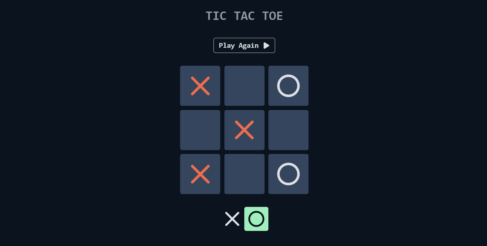

<br>
<br>

# Tic Tac Toe

A simple Tic-Tac-Toe game using **ReactJS**.
<br>
<br>

## ⚡ Install

-   Clone this repository:

```bash
git clone https://github.com/MihirMistry2/tic_tac_toe.git
```

-   Install dependencies:

```
npm i
```

-   Run the app:

```
npm start
```

<br>

## 📘 Used libraries

-   `ReactJS`
-   `Framer Motion`

<br>

## 🔗 Demo

-   [Click Here](https://mihirmistry2.github.io/tic_tac_toe/) to see and play by yourself a demo of the game.

<br>
<br>

Thank You 🙂
